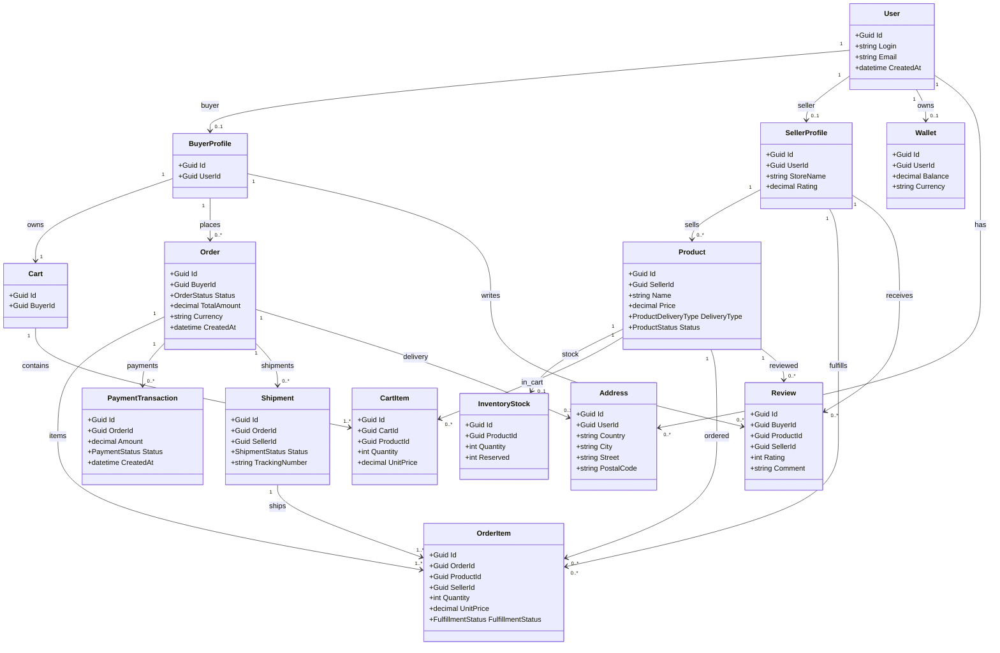

# Этап 1: Проектирование предметной области

## 1. Введение

### 1.1 Бизнес-контекст
Маркетплейс, где множество продавцов размещают товары, а покупатели выбирают их, оформляют заказы и оплачивают покупки. Платформа поддерживает как физические товары с доставкой, так и цифровые товары/услуги с выдачей доступа. Один пользователь может выступать в роли покупателя и/или продавца. Платформа отвечает за каталог, корзину, оформление и оплату заказов, а также за исполнение и отзывы.

### 1.2 Use cases
1. **Регистрация/авторизация** – пользователь создаёт учётную запись или входит в систему
2. **Просмотр каталога и поиск** – покупатель фильтрует и просматривает товары по категориям, цене, рейтингу
3. **Управление товарами продавца** – продавец создаёт товар, редактирует описание, цену и остатки, снимает товар с продажи
4. **Добавление в корзину и оформление заказа** – покупатель добавляет товары в корзину, указывает адрес доставки (для физ. товаров) и оформляет заказ
5. **Оплата заказа** – покупатель оплачивает заказ через внешний платёжный провайдер или внутренний кошелёк, система фиксирует транзакцию
6. **Исполнение заказа** – для физ. товаров создаётся отправка и трекинг; для цифровых – выдаётся доступ/код/файл (возможно отправляется по почте)
7. **Отзывы и рейтинг** – покупатель оставляет отзыв о товаре и продавце после исполнения заказа

## 2. Сущности предметной области

### 2.1 Перечень сущностей
| Сущность | Описание |
|----------|----------|
| `User` | Базовый аккаунт пользователя и набор ролей |
| `BuyerProfile` | Профиль покупателя: корзина, история заказов |
| `SellerProfile` | Профиль продавца: витрина, рейтинг, выплаты |
| `Address` | Адрес доставки пользователя |
| `Product` | Товар в каталоге |
| `InventoryStock` | Остатки товара и резервирование |
| `Cart` | Корзина покупателя |
| `CartItem` | Позиция корзины |
| `Order` | Заказ покупателя |
| `OrderItem` | Позиция заказа |
| `PaymentTransaction` | Платёж/попытка оплаты заказа |
| `Wallet` | Внутренний баланс пользователя |
| `Shipment` | Отправка |
| `Review` | Отзыв покупателя на товар/продавца |

### 2.2 Роли и ключевые статусы
- **Роли пользователя:** `Buyer`, `Seller` (пользователь может иметь обе роли)
- **Тип доставки товара:** `ProductDeliveryType` = `Physical` | `Digital`
- **Статусы заказа:** `OrderStatus` = `Draft` | `Placed` | `Paid` | `Fulfilled` | `Completed` | `Cancelled`
- **Статусы платежа:** `PaymentStatus` = `Pending` | `Succeeded` | `Failed` | `Refunded`
- **Статусы доставки:** `ShipmentStatus` = `Created` | `InTransit` | `Delivered` | `Cancelled`
- **Статусы исполнения позиции:** `FulfillmentStatus` = `Pending` | `Delivered`

## 3. Связи между сущностями и ограничения

### 3.1 Таблица связей
| Сущность 1 | Тип связи | Сущность 2 | Описание |
|------------|-----------|------------|-----------|
| `User` | 1-0..1 | `BuyerProfile` | Пользователь может быть покупателем |
| `User` | 1-0..1 | `SellerProfile` | Пользователь может быть продавцом |
| `User` | 1-0..1 | `Wallet` | Внутренний баланс пользователя |
| `User` | 1-N | `Address` | Несколько адресов доставки |
| `BuyerProfile` | 1-1 | `Cart` | У покупателя одна активная корзина |
| `BuyerProfile` | 1-N | `Order` | История заказов покупателя |
| `BuyerProfile` | 1-N | `Review` | Покупатель оставляет отзывы |
| `SellerProfile` | 1-N | `Product` | Продавец создаёт товары |
| `SellerProfile` | 1-N | `OrderItem` | Каждая позиция имеет продавца |
| `SellerProfile` | 1-N | `Review` | Отзывы о продавце |
| `Product` | 1-0..1 | `InventoryStock` | Остатки товара |
| `Product` | 1-N | `CartItem` | Товар может быть в корзинах |
| `Product` | 1-N | `OrderItem` | Товар может быть в заказах |
| `Product` | 1-N | `Review` | Отзывы на товар |
| `Cart` | 1-N | `CartItem` | Корзина содержит позиции |
| `Order` | 1-N | `OrderItem` | Заказ содержит позиции |
| `Order` | 1-N | `PaymentTransaction` | Попытки оплатить заказ |
| `Order` | 1-0..N | `Shipment` | Отправки по заказу |
| `Shipment` | 1-N | `OrderItem` | Отправка содержит физические позиции |
| `Order` | 1-0..1 | `Address` | Адрес доставки заказа |

### 3.2 Ограничения
1. `User.email` и `User.login` должны быть уникальными
2. Пользователь должен иметь хотя бы одну роль; профиль создаётся только для назначенной роли
3. `SellerProfile.storeName` уникален на платформе
4. `Product.price` > 0; `InventoryStock.quantity` и `reserved` не могут быть отрицательными
5. Для `ProductDeliveryType = Digital` остатки опциональны; для `Physical` остатки обязательны
6. `CartItem.quantity` не может превышать доступный остаток для физических товаров
7. `Order.totalAmount` равен сумме позиций заказа и стоимости доставки; успешный платёж должен совпадать по сумме
8. Для одного заказа допускается только одна успешная транзакция; остальные считаются отменёнными/ошибочными
9. `Shipment` создаётся только для физических позиций заказа
10. Отзыв можно оставить только после исполнения позиции (`Fulfilled`), один отзыв на позицию от одного покупателя
11. Нельзя удалить товар, если по нему есть активные (не отменённые) позиции заказов
12. Адрес доставки обязателен, если заказ содержит физические товары

## 4. Артефакты

### 4.1 UML-диаграмма

### 4.2 Описание доменных моделей
- **`User`** – базовый аккаунт пользователя. Данные: `id`, `login`, `email`, `createdAt`, `roles`.
- **`BuyerProfile`** – профиль покупателя: `id`, `userId`, `cartId`.
- **`SellerProfile`** – профиль продавца: `id`, `userId`, `storeName`, `rating`, `payoutType`.
- **`Address`** – адрес доставки: `id`, `userId`, `country`, `city`, `street`, `postalCode`.
- **`Wallet`** – внутренний кошелёк: `id`, `userId`, `balance`, `currency`.
- **`Product`** – товар продавца: `id`, `sellerId`, `name`, `price`, `deliveryType`, `status`.
- **`InventoryStock`** – остатки: `productId`, `quantity`, `reserved`.
- **`Cart`** – корзина покупателя: `id`, `buyerId`.
- **`CartItem`** – позиция корзины: `cartId`, `productId`, `quantity`, `unitPrice`.
- **`Order`** – заказ: `id`, `buyerId`, `status`, `totalAmount`, `currency`, `createdAt`.
- **`OrderItem`** – позиция заказа: `orderId`, `productId`, `sellerId`, `quantity`, `unitPrice`, `fulfillmentStatus`.
- **`PaymentTransaction`** – платёж по заказу: `orderId`, `amount`, `status`, `createdAt`.
- **`Shipment`** – отправка: `orderId`, `sellerId`, `status`, `trackingNumber`.
- **`Review`** – отзыв: `buyerId`, `productId`, `sellerId`, `rating`, `comment`.

### 4.3 Список бизнес-правил
1. Пользователь может быть одновременно покупателем и продавцом
2. Продавец может публиковать товары только после заполнения платёжных реквизитов
3. При оформлении заказа позиции группируются по продавцам для исполнения
4. Заказ проходит статусы: `Draft` - `Placed` - `Paid` - `Fulfilled` - `Completed` (отмена возможна до `Paid`)
5. Успешный платёж переводит заказ в статус `Paid`, неуспешный — оставляет `Placed`
6. Для физ. товаров создаётся `Shipment` с трекингом; для цифровых — фиксируется выдача доступа
7. Рейтинг продавца рассчитывается на основе отзывов по его товарам
8. Покупатель может оставить отзыв только по товару, который был исполнен
9. Редактирование цены товара не влияет на уже оформленные позиции заказов
10. Снятие товара с продажи не отменяет уже оформленные заказы
