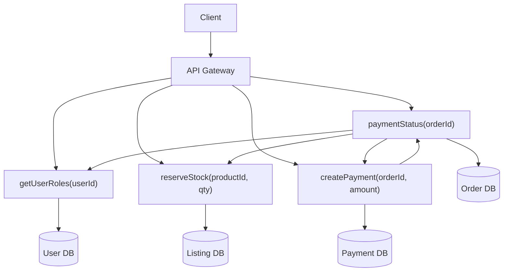
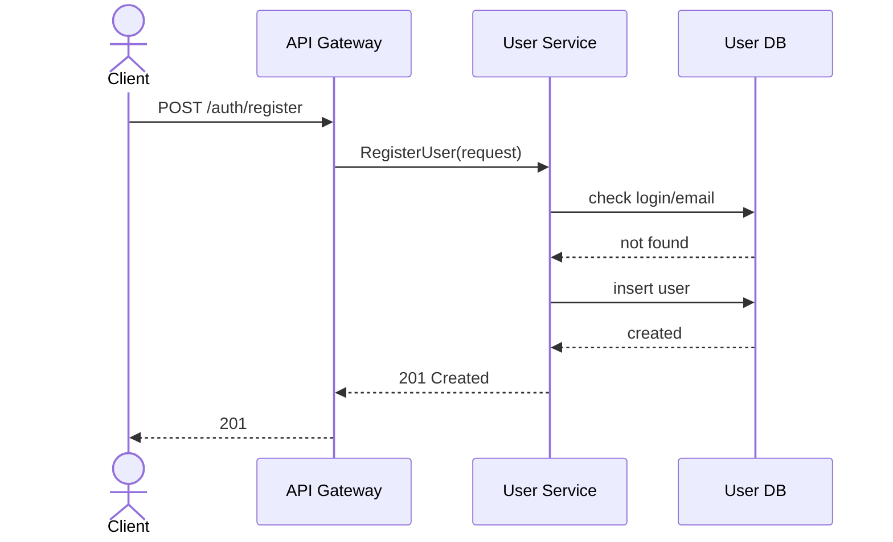
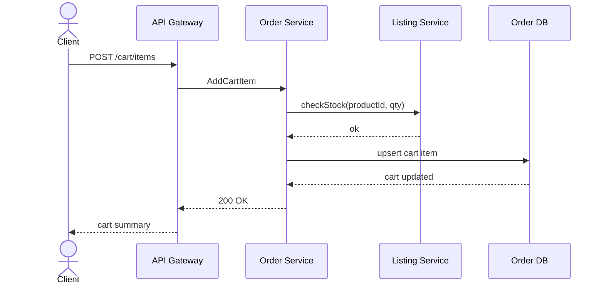
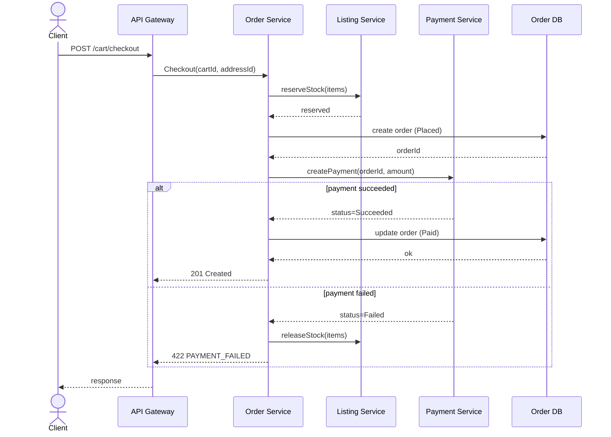
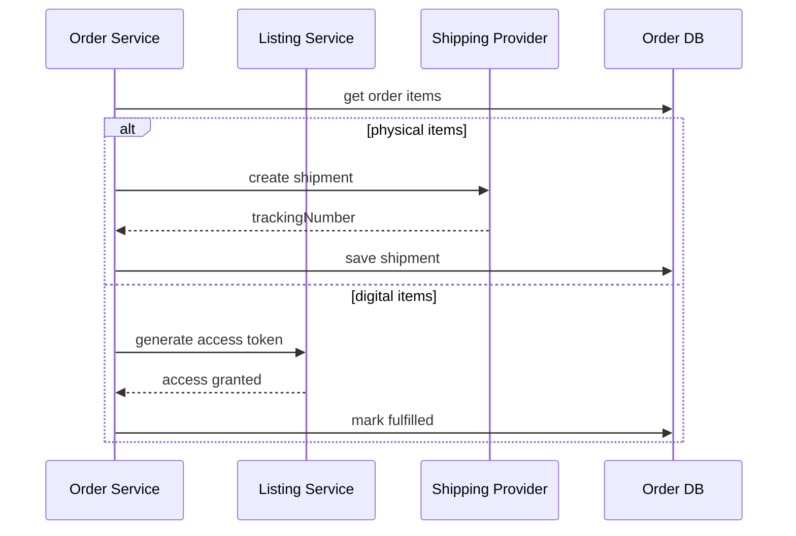

# Этап 2: Проектирование API и контрактов

## 1. Разбиение на сервисы

- **User Service** — регистрация, аутентификация, роли, профили, адреса доставки
- **Listing Service** — товары, категории, остатки, поиск и фильтрация
- **Order Service** — корзина, оформление заказа, статусы, доставка
- **Payment Service** — платежи, кошелек, возвраты

**Владение данными:**
- User Service: `User`, `BuyerProfile`, `SellerProfile`, `Address`
- Listing Service: `Product`, `InventoryStock`, `Category`
- Order Service: `Cart`, `CartItem`, `Order`, `OrderItem`, `Shipment`
- Payment Service: `Wallet`, `PaymentTransaction`

### 1.1 Схема взаимодействия сервисов


## 2. REST API Endpoints

**Базовый путь:** `/api/v1`  \
**Аутентификация:** JWT Bearer (`Authorization: Bearer <token>`)

### 2.1 User Service
- `POST` `/auth/register` — регистрация (Публичный)
- `POST` `/auth/login` — вход (Публичный)
- `POST` `/auth/refresh` — обновление токена (Публичный)
- `GET` `/users/me` — профиль текущего пользователя (Authenticated)
- `PATCH` `/users/me` — обновить профиль (Authenticated)
- `POST` `/users/me/roles/seller` — стать продавцом (Authenticated)
- `GET` `/users/me/addresses` — список адресов (Authenticated)
- `POST` `/users/me/addresses` — добавить адрес (Authenticated)
- `PATCH` `/users/me/addresses/{addressId}` — обновить адрес (Authenticated)
- `DELETE` `/users/me/addresses/{addressId}` — удалить адрес (Authenticated)

### 2.2 Listing Service
- `POST` `/products` — создать товар (Seller)
- `GET` `/products` — список товаров с фильтрами и пагинацией (Публичный)
- `GET` `/products/{productId}` — детали товара (Публичный)
- `PATCH` `/products/{productId}` — обновить товар (Seller)
- `PATCH` `/products/{productId}/stock` — обновить остатки (Seller)
- `DELETE` `/products/{productId}` — снять товар с продажи (Seller)
- `GET` `/categories` — список категорий (Публичный)
- `POST` `/categories` — создать категорию (Admin)

### 2.3 Order Service
- `GET` `/cart` — текущая корзина (Buyer)
- `POST` `/cart/items` — добавить товар в корзину (Buyer)
- `PATCH` `/cart/items/{itemId}` — изменить количество (Buyer)
- `DELETE` `/cart/items/{itemId}` — удалить позицию (Buyer)
- `POST` `/cart/checkout` — оформить заказ (Buyer)
- `GET` `/orders` — список заказов (Buyer)
- `GET` `/orders/{orderId}` — детали заказа (Buyer)
- `GET` `/orders/{orderId}/status` — статус заказа (Buyer)
- `POST` `/orders/{orderId}/cancel` — отмена заказа (Buyer)
- `GET` `/orders/{orderId}/shipments` — отправки по заказу (Buyer)

### 2.4 Payment Service
- `POST` `/payments` — оплатить заказ (Buyer)
- `GET` `/payments/{paymentId}` — детали платежа (Buyer)
- `POST` `/payments/{paymentId}/refund` — возврат (Admin)
- `GET` `/wallet` — баланс кошелька (Authenticated)
- `POST` `/wallet/topup` — пополнить кошелек (Authenticated)
- `POST` `/wallet/withdraw` — вывести средства (Seller)

## 3. Контракты

### 3.1 User Service
```jsonc
// POST /auth/register
// Request
{
  "login": "janedoe",
  "email": "jane@gmail.com",
  "password": "chrysalis219"
}

// Response (201 Created)
{
  "id": "3fa85f64-5717-4562-b3fc-2c963f66afa6",
  "login": "janedoe",
  "email": "jane@gmail.com",
  "roles": ["Buyer"],
  "createdAt": "2026-05-25T10:30:00Z"
}
```

```jsonc
// POST /auth/login
// Request
{
  "email": "jane@gmail.com",
  "password": "chrysalis219"
}

// Response (200 OK)
{
  "accessToken": "eyJhbGciOiJIUzI1NiIs...",
  "refreshToken": "dGhpcyBpcyBhIHJlZnJl...",
  "expiresIn": 3600,
  "user": {
    "id": "3fa85f64-5717-4562-b3fc-2c963f66afa6",
    "login": "janedoe",
    "email": "jane@gmail.com",
    "roles": ["Buyer"]
  }
}
```

### 3.2 Listing Service
```jsonc
// POST /products
// Request
{
  "name": "Беспроводная мышь",
  "description": "Эргономичная беспроводная мышь",
  "price": 2999.99,
  "currency": "RUB",
  "deliveryType": "Physical",
  "categoryIds": ["3fa85f64-5717-4562-b3fc-2c963f66afa1"],
  "stock": 100
}

// Response (201 Created)
{
  "id": "3fa85f64-5717-4562-b3fc-2c963f66afa2",
  "sellerId": "3fa85f64-5717-4562-b3fc-2c963f66afa6",
  "name": "Беспроводная мышь",
  "price": 2999.99,
  "currency": "RUB",
  "deliveryType": "Physical",
  "status": "Active",
  "createdAt": "2026-05-25T11:00:00Z"
}
```

### 3.3 Order Service
```jsonc
// POST /cart/items
// Request
{
  "productId": "3fa85f64-5717-4562-b3fc-2c963f66afa2",
  "quantity": 2
}

// Response (200 OK)
{
  "cartId": "3fa85f64-5717-4562-b3fc-2c963f66afa7",
  "items": [
    {
      "itemId": "3fa85f64-5717-4562-b3fc-2c963f66afa8",
      "productId": "3fa85f64-5717-4562-b3fc-2c963f66afa2",
      "quantity": 2,
      "unitPrice": 2999.99
    }
  ],
  "total": 5999.98,
  "currency": "RUB"
}
```

```jsonc
// POST /cart/checkout
// Request
{
  "addressId": "3fa85f64-5717-4562-b3fc-2c963f66afb0",
  "paymentMethod": "Wallet"
}

// Response (201 Created)
{
  "orderId": "3fa85f64-5717-4562-b3fc-2c963f66afb1",
  "status": "Placed",
  "amount": 5999.98,
  "currency": "RUB",
  "requiresPayment": true
}
```

### 3.4 Payment Service
```jsonc
// POST /payments
// Request
{
  "orderId": "3fa85f64-5717-4562-b3fc-2c963f66afb1",
  "method": "Wallet"
}

// Response (200 OK)
{
  "paymentId": "3fa85f64-5717-4562-b3fc-2c963f66afb2",
  "orderId": "3fa85f64-5717-4562-b3fc-2c963f66afb1",
  "status": "Succeeded",
  "amount": 5999.98,
  "currency": "RUB"
}
```

## 4. Обработка ошибок

### 4.1 Стандартный формат ошибки
```jsonc
{
  "error": {
    "code": "VALIDATION_ERROR",
    "message": "Описание ошибки",
    "details": [
      { "field": "addressId", "message": "Адрес доставки должен быть корректным" }
    ]
  }
}
```

### 4.2 Коды ответов
- `200 OK` — успешный запрос (`GET`, `PATCH`)
- `201 Created` — ресурс создан (`POST`)
- `204 No Content` — успех без тела (`DELETE`)
- `400 Bad Request` — некорректный JSON или формат
- `401 Unauthorized` — нет/просрочен `accessToken`
- `403 Forbidden` — недостаточно прав
- `404 Not Found` — ресурс не найден
- `409 Conflict` — конфликт данных
- `422 Unprocessable Entity` — бизнес-правило нарушено
- `429 Too Many Requests` — лимит запросов
- `500 Internal Server Error` — внутренняя ошибка

### 4.3 Ошибки бизнес-логики по сценариям
- **Email уже занят** — `409` `DUPLICATE_EMAIL`
- **Логин уже занят** — `409` `DUPLICATE_LOGIN`
- **Неверные учетные данные** — `401` `INVALID_CREDENTIALS`
- **Токен просрочен** — `401` `TOKEN_EXPIRED`
- **Товар не найден** — `404` `PRODUCT_NOT_FOUND`
- **Недостаточно прав продавца** — `403` `NOT_SELLER`
- **Недостаточно остатков** — `422` `INSUFFICIENT_STOCK`
- **Неверный переход статуса заказа** — `422` `INVALID_ORDER_TRANSITION`
- **Заказ не найден** — `404` `ORDER_NOT_FOUND`
- **Попытка оплаты без товара** — `422` `EMPTY_CART`
- **Платеж не прошел** — `422` `PAYMENT_FAILED`
- **Возврат запрещен** — `422` `REFUND_NOT_ALLOWED`
- **Адрес не найден** — `404` `ADDRESS_NOT_FOUND`

## 5. OpenAPI (Swagger)
См. `openapi.yaml`

## 6. Sequence Diagrams

### 6.1 Регистрация пользователя


### 6.2 Добавление товара в корзину


### 6.3 Оформление заказа и оплата


### 6.4 Исполнение заказа

